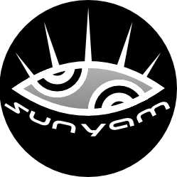

<!-- Improved compatibility of back to top link: See: https://github.com/suny-am/documentation-templates/pull/73 -->
<a name="readme-top"></a>
<!--
*** Thanks for checking out the Best-README-Template. If you have a suggestion
*** that would make this better, please fork the repo and create a pull request
*** or simply open an issue with the tag "enhancement".
*** Don't forget to give the project a star!
*** Thanks again! Now go create something AMAZING! :D
-->


<!-- PROJECT SHIELDS -->
<!--
*** I'm using markdown "reference style" links for readability.
*** Reference links are enclosed in brackets [ ] instead of parentheses ( ).
*** See the bottom of this document for the declaration of the reference variables
*** for contributors-url, forks-url, etc. This is an optional, concise syntax you may use.
*** https://www.markdownguide.org/basic-syntax/#reference-style-links
-->
[![Contributors][contributors-shield]][contributors-url]
[![Forks][forks-shield]][forks-url]
[![Stargazers][stars-shield]][stars-url]
[![Issues][issues-shield]][issues-url]
[![MIT License][license-shield]][license-url]
[![LinkedIn][linkedin-shield]][linkedin-url]


<!-- PROJECT LOGO -->
<br />
<div align="center">
  <a href="https://github.com/suny-am/documentation-templates">
    
  </a>

  <h3 align="center">Best-README-Template</h3>

  <p align="center">
    An awesome README template to jumpstart your projects!
    <br />
    <a href="https://github.com/suny-am/documentation-templates"><strong>Explore the docs »</strong></a>
    <br />
    <br />
    <a href="https://github.com/suny-am/documentation-templates">View Demo</a>
    ·
    <a href="https://github.com/suny-am/documentation-templates/issues/new?labels=bug&template=bug-report---.md">Report Bug</a>
    ·
    <a href="https://github.com/suny-am/documentation-templates/issues/new?labels=enhancement&template=feature-request---.md">Request Feature</a>
  </p>
</div>


<!-- TABLE OF CONTENTS -->
<details>
  <summary>Table of Contents</summary>
  <ol>
    <li>
      <a href="#about-the-project">About The Project</a>
      <ul>
        <li><a href="#built-with">Built With</a></li>
      </ul>
    </li>
    <li>
      <a href="#getting-started">Getting Started</a>
      <ul>
        <li><a href="#prerequisites">Prerequisites</a></li>
        <li><a href="#installation">Installation</a></li>
      </ul>
    </li>
    <li><a href="#usage">Usage</a></li>
    <li><a href="#roadmap">Roadmap</a></li>
    <li><a href="#contributing">Contributing</a></li>
    <li><a href="#license">License</a></li>
    <li><a href="#contact">Contact</a></li>
    <li><a href="#acknowledgments">Acknowledgments</a></li>
    <li><a href="#references">References</a></li>
  </ol>
</details>


<!-- ABOUT THE PROJECT -->
## About The Project

[![Product Name Screen Shot][product-screenshot]](https://example.com)

There are many great README templates available on GitHub; however, I didn't find one that really suited my needs so I created this enhanced one. I want to create a README template so amazing that it'll be the last one you ever need -- I think this is it.

Here's why:
* Your time should be focused on creating something amazing. A project that solves a problem and helps others
* You shouldn't be doing the same tasks over and over like creating a README from scratch
* You should implement DRY principles to the rest of your life :smile:

Of course, no one template will serve all projects since your needs may be different. So I'll be adding more in the near future. You may also suggest changes by forking this repo and creating a pull request or opening an issue. Thanks to all the people have contributed to expanding this template!

Use the `BLANK_README.md` to get started.

<p align="right"><a href="#readme-top">🔝</a></p>


### Built With

This section should list any major frameworks/libraries used to bootstrap your project. Leave any add-ons/plugins for the acknowledgements section. Here are a few examples.

[![Bun][Bun]][Bun-url]
<br> 
[![Next][Next.js]][Next-url]
<br> 
[![React][React.js]][React-url]
<br> 
[![Vite][Vite]][Vite-url]
<br> 
[![Vue][Vue.js]][Vue-url]
<br> 
[![K3s][K3s]][K3s-url]
<br> 
[![Podman][Podman]][Podman-url]
<br> 
[![OpenGL][OpenGL]][OpenGL-url]


<p align="right"><a href="#readme-top">🔝</a></p>


<!-- GETTING STARTED -->
## Getting Started

This is an example of how you may give instructions on setting up your project locally.
To get a local copy up and running follow these simple example steps.

### Prerequisites

This is an example of how to list things you need to use the software and how to install them.
#### Prerequisite 1
  ```sh
  # Relevant prerequisite actions 
  ```

### Installation

#### 1. Clone the repo
   ```sh
   git clone https://github.com/github_username/repo_name.git
   ```
#### 3. Installations
   ```sh
   # Install dependencies
   ```
#### 4. Further steps
   ```sh
   # Further relevant actions
   ```

<p align="right"><a href="#readme-top">🔝</a></p>


<!-- USAGE EXAMPLES -->
## Usage

Use this space to show useful examples of how a project can be used. Additional screenshots, code examples and demos work well in this space. You may also link to more resources.

_For more examples, please refer to the [Documentation](https://example.com)_

<p align="right"><a href="#readme-top">🔝</a></p>


<!-- ROADMAP -->
## Roadmap

- [x] Add Changelog
- [x] Add back to top links
- [ ] Add Additional Templates w/ Examples
- [ ] Add "components" document to easily copy & paste sections of the readme
- [ ] Multi-language Support
    - [ ] Chinese
    - [ ] Spanish

See the [open issues](https://github.com/suny-am/documentation-templates/issues) for a full list of proposed features (and known issues).

<p align="right"><a href="#readme-top">🔝</a></p>


<!-- CONTRIBUTING -->
## Contributing

Contributions are what make the open source community such an amazing place to learn, inspire, and create. Any contributions you make are **greatly appreciated**.

If you have a suggestion that would make this better, please fork the repo and create a pull request. You can also simply open an issue with the tag "enhancement".
Don't forget to give the project a star! Thanks again!

### 1. Fork the Project
```sh
gh repo fork suny-am/documentation-templates --clone
cd documentation-templates
```
### 2. Create your Feature Branch 
```sh
git checkout -b feature/aNewCoolFeature
```
### 3. Commit your Changes 
```sh
`git commit -m 'Add a new cool feature'
```
### 4. Push to the Branch 
```sh
git push origin feature/aNewCoolFeature
```
### 5. Open a Pull Request
```sh
gh pr create 
```

<p align="right"><a href="#readme-top">🔝</a></p>


<!-- LICENSE -->
## License

Distributed under the MIT License. See [LICENSE.txt](LICENSE.txt) for more information.

<p align="right"><a href="#readme-top">🔝</a></p>


<!-- CONTACT -->
## Contact

Your Name - [@bsky_handle](https://bsky.app/profile/bsky_handle) - email@email_client.com

Project Link: [https://github.com/your_username/repo_name](https://github.com/your_username/repo_name)

<p align="right"><a href="#readme-top">🔝</a></p>


<!-- ACKNOWLEDGMENTS -->
## Acknowledgments

Use this space to list resources you find helpful and would like to give credit to. I've included a few of my favorites to kick things off!

* [Choose an Open Source License](https://choosealicense.com)
* [GitHub Emoji Cheat Sheet](https://www.webpagefx.com/tools/emoji-cheat-sheet)
* [Malven's Flexbox Cheatsheet](https://flexbox.malven.co/)
* [Malven's Grid Cheatsheet](https://grid.malven.co/)
* [Img Shields](https://shields.io)
* [GitHub Pages](https://pages.github.com)
* [Font Awesome](https://fontawesome.com)
* [React Icons](https://react-icons.github.io/react-icons/search)

<p align="right"><a href="#readme-top">🔝</a></p>

<!-- REFERENCES -->
## References 📚

Here are some resources that were helpful in creating this project:

- [GitHub Markdown Guide](https://guides.github.com/features/mastering-markdown/)
- [Markdown Cheatsheet](https://www.markdownguide.org/cheat-sheet/)
- [Emoji Cheat Sheet](https://www.webfx.com/tools/emoji-cheat-sheet/)
- [ASCII Art Archive](https://www.asciiart.eu/)
- [Awesome Badges](https://github.com/Envoy-VC/awesome-badge)
- [Complete list of markdown emoji markup](https://gist.github.com/rxaviers/7360908)
- [favourite website and app logos ](https://github.com/edent/SuperTinyIcons)
- [Online markdown preview ](https://stackedit.io/app)
- [Shield.io Badges](https://shields.io/)
- [Find Some cool Arts](https://neocities.org/browse)

<p align="right"><a href="#readme-top">🔝</a></p>

<!-- MARKDOWN LINKS & IMAGES -->
<!-- https://www.markdownguide.org/basic-syntax/#reference-style-links -->
[contributors-shield]: https://img.shields.io/github/contributors/suny-am/documentation-templates.svg?style=for-the-badge
[contributors-url]: https://github.com/suny-am/documentation-templates/graphs/contributors
[forks-shield]: https://img.shields.io/github/forks/suny-am/documentation-templates?style=for-the-badge
[forks-url]: https://github.com/suny-am/documentation-templates/network/members
[stars-shield]: https://img.shields.io/github/stars/suny-am/documentation-templates.svg?style=for-the-badge
[stars-url]: https://github.com/suny-am/documentation-templates/stargazers
[issues-shield]: https://img.shields.io/github/issues/suny-am/documentation-templates.svg?style=for-the-badge
[issues-url]: https://github.com/suny-am/documentation-templates/issues
[license-shield]: https://img.shields.io/github/license/suny-am/documentation-templates.svg?style=for-the-badge
[license-url]: https://github.com/suny-am/documentation-templates/blob/master/LICENSE.txt
[linkedin-shield]: https://img.shields.io/badge/-LinkedIn-black.svg?style=for-the-badge&logo=linkedin&colorB=555
[linkedin-url]: https://linkedin.com/in/carl-sandberg-01070a2b6/
[product-screenshot]: .docs/images/screenshot.png
[Next.js]: https://img.shields.io/badge/next.js-000000?style=for-the-badge&logo=nextdotjs&logoColor=white
[Next-url]: https://nextjs.org/
[React.js]: https://img.shields.io/badge/React-20232A?style=for-the-badge&logo=react&logoColor=61DAFB
[React-url]: https://reactjs.org/
[Vue.js]: https://img.shields.io/badge/Vue.js-35495E?style=for-the-badge&logo=vuedotjs&logoColor=4FC08D
[Vue-url]: https://vuejs.org/
[Rails]: https://img.shields.io/badge/rails-%23CC0000.svg?style=for-the-badge&logo=ruby-on-rails&logoColor=white
[Rails-url]: https://rubyonrails.org
[.NET]: https://img.shields.io/badge/.NET-5C2D91?style=for-the-badge&logo=.net&logoColor=white
[.NET-url]: https://dotnet.microsoft.com/
[Vite]: https://img.shields.io/badge/vite-%23646CFF.svg?style=for-the-badge&logo=vite&logoColor=white
[Vite-url]: https://vitejs.dev/
[OpenGL]: https://img.shields.io/badge/OpenGL-%23FFFFFF.svg?style=for-the-badge&logo=opengl
[OpenGL-url]: https://www.opengl.org/
[Bun]: https://img.shields.io/badge/Bun-%23000000.svg?style=for-the-badge&logo=bun&logoColor=white
[Bun-url]: https://bun.sh/
[Blazor]: https://img.shields.io/badge/blazor-%235C2D91.svg?style=for-the-badge&logo=blazor&logoColor=white
[Blazor-url]: https://dotnet.microsoft.com/en-us/apps/aspnet/web-apps/blazor/
[K3s]:https://img.shields.io/badge/K3s-000000?style=for-the-badge&logo=k3s&logoColor=FFC61C
[K3s-url]:https://docs.k3s.io
[Podman]: https://img.shields.io/badge/podman-000000?style=for-the-badge&logo=podman&logoColor=white&logoSize=large&color=892CA0
[Podman-url]:https://podman.io
